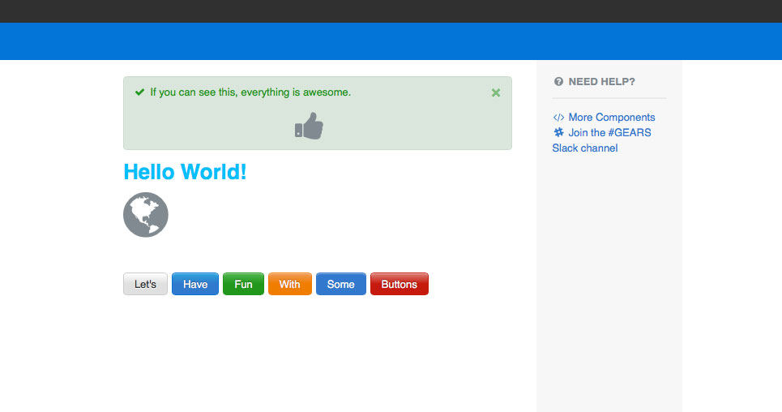

# Appfolio React app template

This template can be used directly for the creation of new React client apps in APM.
It also includes a dev server with hot reloading for quickly developing a React UI outside of APM.

#### Includes

- ES2015 using [Webpack](https://webpack.github.io/) and [Babel](https://babeljs.io/)
- [React](https://facebook.github.io/react/) and [Babel](https://babeljs.io/)
- CSS with autoprefixing using [PostCSS](http://postcss.org/) 
- SCSS using [sass-loader](https://github.com/jtangelder/sass-loader) 
- Development server and reloading using [webpack-dev-middleware](https://github.com/webpack/webpack-dev-middleware) and [webpack-hot-middleware](https://github.com/glenjamin/webpack-hot-middleware)
- Unit tests using [Mocha](https://mochajs.org/), [enzyme](http://airbnb.io/enzyme/index.html), and [assert](https://nodejs.org/api/assert.html)
- Linting using [ESLint](http://eslint.org/)
- Code coverage using [nyc](https://github.com/istanbuljs/nyc)

#### Using
The sample code under `/src` is a basic React example to ensure bundling works correctly:



The dev page uses a _rough_ _approximation_ of the APM Property app layout to help while developing, 
and can be changed or removed from ./public/index.html. 
It's not part of your app or production bundle, so don't freak out.

----

### Setup

    npm install

### Develop

    npm start
Open [http://localhost:8080](http://localhost:8080) in browser

- Uses [hot-module-replacement](https://webpack.github.io/docs/hot-module-replacement.html) to automatically rebuild and reload modules as the files under `src` are modified.

### Add Into Property
To render your client app in property you'll need a standard controller and view. In your view you'll need some HTML element to attach your app to. Best practice is to have a `div` with an `id`. Structure your `.html.erb` file something like this:

```
<%= content_for :javascript do %>
    <%= javascript_include_tag 'app_name' %>
<% end %>

<div id="app_name_main"></div>
```

where `app_name` is the name of your client app.

In you main `index.js` file you'll want something like:

```
render(
  <App />,
  document.getElementById('app_name_main')
);
```

This will allow React to know where to drop its render results into the DOM.

You'll also need to create a standard Rails javascript file named after the view your client app renders in. In that javascript file all you need is a line requiring your bundle app that looks like this: 

```
//= require app_name-bundle
```

Finally add your view javascript file to the asset precompile path and you should be good to go!

### Test

    npm test

- Runs unit tests using [Mocha](https://mochajs.org/) and [enzyme](http://airbnb.io/enzyme/index.html),
- Shows code coverage using [nyc/Istanbul](https://github.com/istanbuljs/nyc).
  A coverage report will also be written in the `./coverage/` directory.

### Lint

    npm run lint

- Runs [ESLint](http://eslint.org/) using [airbnb-base](https://www.npmjs.com/package/eslint-config-airbnb-base) as the base configuration

----

### Contributors
- Gary Thomas
- Li Zhang
- Tim Connor
- Michael Jewell
